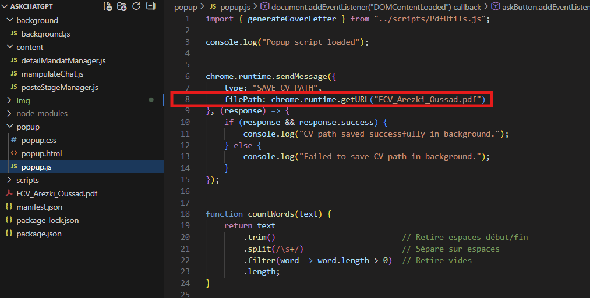
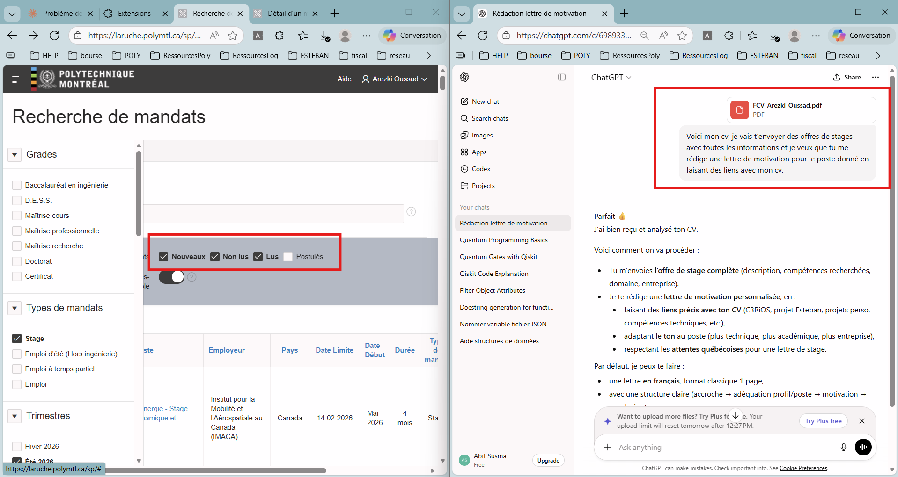
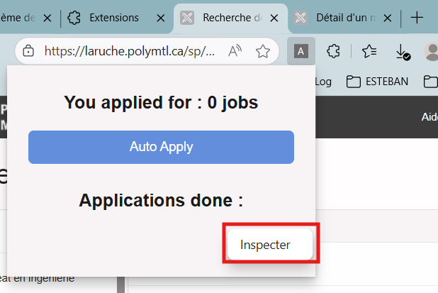
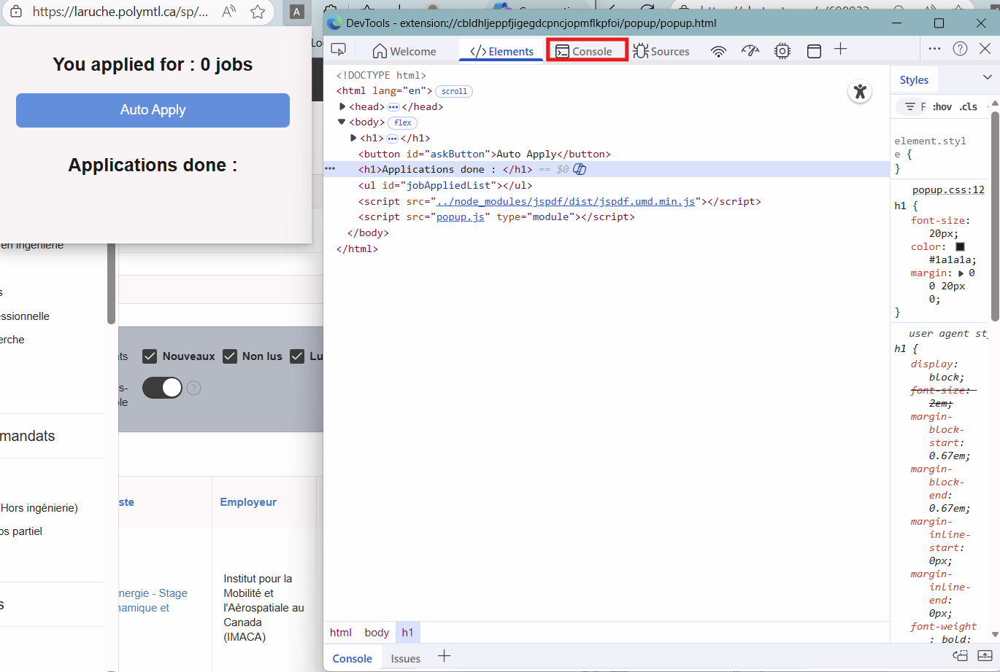

# AutoApply, La Ruche édition

Une extension facile à prendre en main qui postule à votre place!

## 📋 Résumé du projet

Cette extension permet d'appliquer automatiquement aux offres sur la ruches qui nécessite un format
CV / Lettre de Motivation / Relevé. Cette automatisation inclu la génération d'un fichier pdf d'une lettre de motivation 
automatique et directement remplit dans le champ sur la page du mandat de stage. L'extension y ajoute le CV et choisit le
relevé, avant de cliquer sur postuler, fermer la page et passer au poste suivant!

**Fonctionnalités principales :**
- Détecter tous les liens vers les mandats de stage et itérer dessus
- Vérifier que la page suit le format adéquat pour postuler
- Récupère les informations de l'offre 
- Effectue un script afin de prompt ChatGPT et récupérer la lettre générée
- Crée un fichier PDF de lettre de motivation et le sauvegarde localement
- Remplir le formulaire de demande d'embauche et postuler

**Technologies utilisées :**
- Manifest V3
- JavaScript
- Chrome Extensions API

## 🚀 Installation sur Edge

### Méthode 1 : Installation en mode développeur

1. Téléchargez ou clonez ce repository
2. Ouvrez Microsoft Edge et allez sur `edge://extensions/`
3. Activez le **Mode développeur** (toggle en bas à gauche)
4. Cliquez sur **Charger l'extension décompressée**
5. Sélectionnez le dossier de l'extension contenant le fichier manifest.json à la racine 
6. L'extension apparaîtra dans votre barre d'outils (N'oubliez pas de l'épingler)

### Méthode 2 : Depuis un fichier .zip

1. Téléchargez le fichier `.zip` de l'extension
2. Décompressez le fichier
3. Suivez les étapes 2-6 de la Méthode 1

> **Note :** L'extension fonctionne également sur Chrome en suivant les mêmes étapes sur `chrome://extensions/`

## Subtilité dans le code

### Ajout du CV personnel dans le répertoire
Ajoutez votre CV à la racine de l'extension, au même niveau que le **manifest.json**. Il faut aussi modifier une ligne de code dans le fichier popup/popup.js afin de sauvegarder le bon pdf dans votre navigateur.

### Formatage de la lettre de motivation générée
J'ai laissé mon nom pour tronquer la réponse de chatgpt, ainsi que pour le formattage de la lettre de motivation. Il faut donc modifier ces lignes dans les fichiers **Script.PdfUtils.js** et **content/manipulateChat.js**

## ⚙️ Configuration des onglets

### Première utilisation

Aucun setup n'est spécifique, vérifiez seulement que votre extension figure à droite de la barre de recherche du navigateur,
sinon clickez sur l'icone de puzzle et épinglez l'extension.

### Organiser vos onglets

**Site des offres de stages de polytechnique**
- Ajustez les filtres proposés par le site afin d'afficher que les postes qui vous intéresse
- N'oubliez pas de cocher tous les filtres de consultation, sauf les stages auquels vous avez déjà postulé*
*Fiez vous à l'image qui suit

**Préparer l'onglet ChatGpt**
- Ouvrez une nouvelle fenêtre (⚠️pas onglet!) et accédez à une conversation sur votre compte
- Préparez le contexte pour que chat puisse recevoir des offres et formuler une lettre de motivation
- ⚠️⚠️⚠️ UNE SEULE PAGE CHATGPT OUVERTE. => Sinon ChromeAPI ne sait pas où envoyer les prompts.

**Ouvrez la console de l'extension afin de suivre l'activité du programme et repérer les erreurs et les arrêts de programme**

L'extension comporte encore plusieurs bugs, mais, rassurez vous, cela arrête le programme et les postulations. En cas d'arrêt, recliquez sur l'extension et, si besoin, rechargez toutes les pages et asurez-vous d'avoir une instance de chaque onglet.
 - Clic droit sur le popup de l'extension et inspect
 - Ouvrez la console du popup

## 🐛 Bugs courants et solutions

### 1. "Could not establish connection. Receiving end does not exist"

**Cause :** Le content script n'est pas chargé dans l'onglet cible.

**Solution :**
- Rechargez l'onglet où vous utilisez l'extension
- Redémarrez l'extension depuis `edge://extensions/`
- Vérifiez que l'URL de la page est autorisée (les pages `edge://` et `chrome://` ne sont pas accessibles)

### 2. L'extension ne détecte pas les changements de page

**Cause :** Les sites en SPA (Single Page Application) ne rechargent pas la page.

**Solution :**
- Fermez et rouvrez l'onglet
- L'extension se recharge automatiquement après quelques secondes

### 3. Les permissions sont refusées

**Cause :** Permissions insuffisantes dans le manifest.

**Solution :**
1. Allez sur `edge://extensions/`
2. Trouvez votre extension
3. Cliquez sur **Détails**
4. Activez toutes les permissions nécessaires

### 4. L'extension ne s'affiche pas dans la barre d'outils

**Solution :**
- Cliquez sur l'icône Extensions (puzzle) dans la barre d'outils
- Cliquez sur l'icône "pin" à côté du nom de l'extension

## 📝 Notes importantes

- Il est très important que la page de ChatGpt ne soit pas dans la même fenêtre. Chrome allouera plus de ressources pour générer les lettres de motivation, qui est l'étape la plus longue du processus.
- Il est possible de rencontrer des bug inconnus, cherchez sur internet ou venez me voir.
- N'oubliez pas de clean up vos téléchargements (beaucoup de lettres de motivations seront générées).

## 🤝 Contribution

Les contributions sont les bienvenues ! N'hésitez pas à ouvrir une issue ou une pull request.

## 📄 Licence

Leak pas kho wallah c'est pas nice

---

**Développé par** Arezki Oussad 
**Version** 1.0.0
